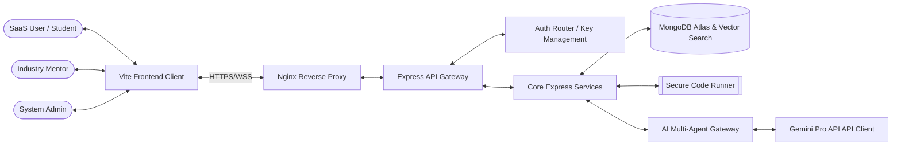

# CareerPilot AI - High Level Design (HLD)

This document describes the high-level software architecture, system layers, components integration flow, and cross-cutting concerns for CareerPilot AI.

---

## 1. System Context & Overview

CareerPilot AI is a multi-tenant, SaaS-grade platform combining advanced AI matching, mock coding rounds, speech/behavioral analyses, and gamified roadmap generation.

---

## 2. Architectural Subsystems

### A. Client App Layer (apps/web)
A single-page application (SPA) built using React 19, TypeScript, and Vite.
- **State Management**: React Query handles backend query/mutation synchronization and HTTP caching. React Hook Form runs input validation client-side.
- **Styling**: Tailwind CSS with custom glassmorphic variables (translucent backdrops, gradient boundaries).
- **Dynamic Elements**: Recharts (interactive dashboards), Framer Motion (micro-animations), Monaco Editor (coding interface), RecordRTC (audio/video recording).

### B. API Gateway & Business Layer (apps/api)
A Node.js Express server structured following Clean Architecture.
- **Service Layer Pattern**: Controllers manage input parsing, validation schemas (`express-validator`), and HTTP responses. The business logic lives in decoupled Service classes.
- **Event Bus**: The platform relies on a Node `EventEmitter` instance serving as an internal event bus. This decouples processes like triggering achievements, updating analytics metrics, or generating notifications when user events occur.
- **Multi-tiered Security**: Rate limiters (express-rate-limit), Helmet, XSS filters, and cookie-based CSRF protection shields the gateway.

### C. Multi-Agent AI Gateway
Rather than simple LLM calls, the backend uses an AI Agent gateway that wraps Gemini API queries.
- **Agent Orchestrator**: Decides prompt parameters, templates, context memories, and handles rate-limits/token consumption tracking.
- **Agents**: 10 specialized profiles (Interview, Resume, ATS, LinkedIn, Career Coach, Roadmap, Job Matching, Recruiter, Recommendation, Behavioral).

### D. Secure Sandbox Executor
A containerized execution stack for running candidate code submissions.
- **Sandbox Router**: Orchestrates executions across Docker containers, public Piston APIs, and Node `vm` contexts.
- **Failsafe System**:
  - Primary: Ephemeral Docker container run with strict limits (`--memory="128m" --cpus="0.5"`).
  - Secondary: Piston API execution with structured timeouts.
  - Fallback: Local VM sandboxed process executing code under restricted memory and process environments.

---

## 3. Data Storage & Search
- **MongoDB Atlas**: Serves as the primary operational store.
- **Atlas Vector Search**: Used for computing semantic similarity between user profiles and job descriptions, search queries, and learning resources.
- **Mongoose ORM**: Enforces schemas, indexes, soft-delete hooks, and compound indexes.

---

## 4. Scaling and Production Preparedness
- **Docker & Compose**: Fully containerized environment using Nginx for SSL offloading and static asset distribution.
- **Monitoring**: Morgan (HTTP request profiling), Winston (structured logger), `/api/health` and `/api/status` check routers.
- **CI/CD**: Auto lint, test, container validation, and staging deploy pipelines using GitHub Actions.
