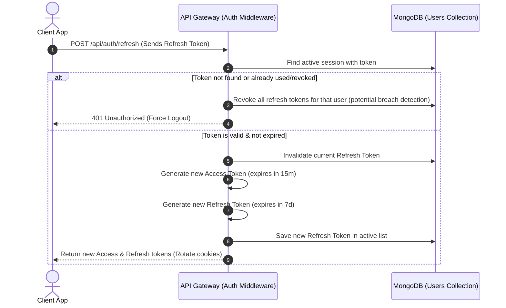
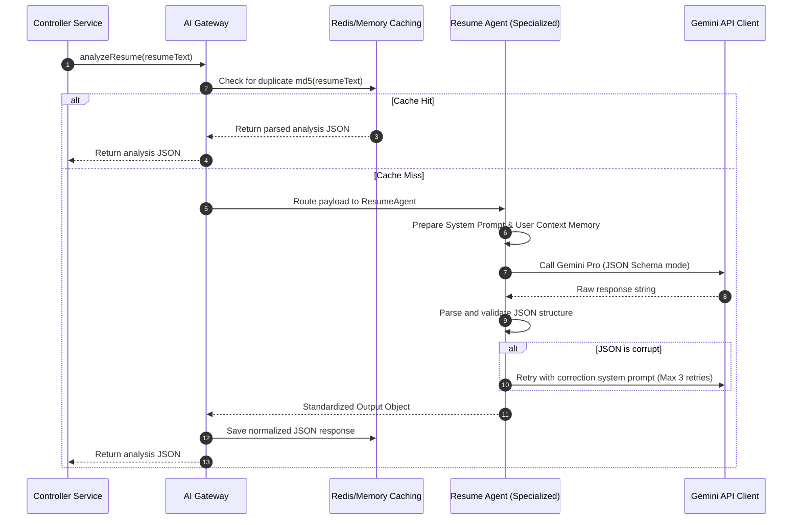
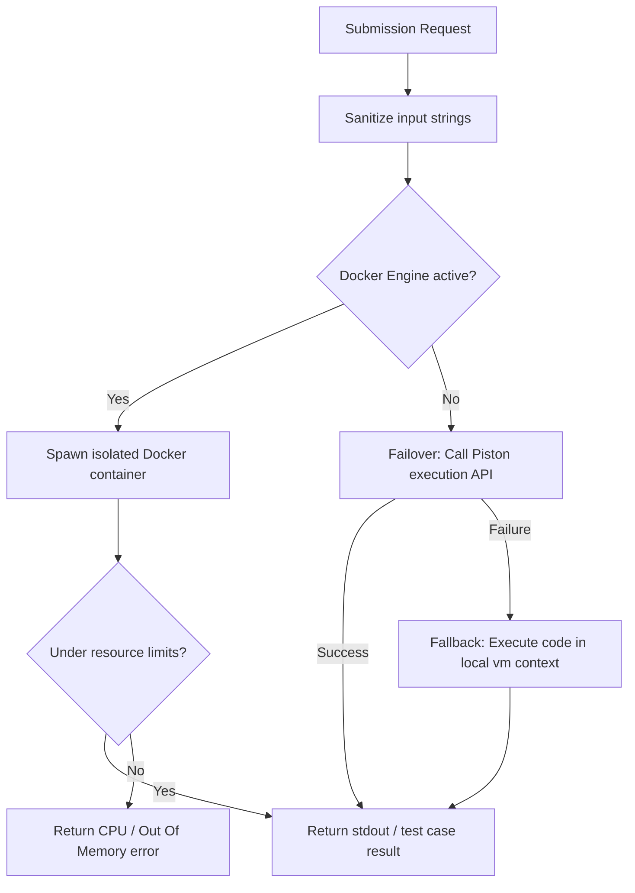

# CareerPilot AI - Low Level Design (LLD)

This document provides detailed software specifications, design patterns, and interaction diagrams for the core features of the system.

---

## 1. Authentication & Session Management
CareerPilot AI implements a strict token rotation strategy utilizing short-lived Access Tokens (JWT, HTTP-only cookie or authorization header) and long-lived Refresh Tokens (stored in DB with rotation flags).

### Sequence Diagram: Token Refresh Rotation

---

## 2. Multi-Agent AI Gateway System
All queries to the Gemini API flow through the `AIGateway` to ensure caching, validation, JSON response format integrity, and retry fallback loops.

### Component Design & Orchestration Flow

---

## 3. Secure Code Execution Pipeline
The sandboxing compiler engine evaluates user programs using three tiered strategies to protect the backend node environment.

---

## 4. Event-Driven Architecture Components
System processes are decoupled through an internal Event Bus (`AppEventBus` extending Node's `EventEmitter`).

### Domain Topics and Observers
- **Topic: `INTERVIEW_COMPLETED`**:
  - `AchievementHandler`: Computes XP adjustments, unlocks candidate badges.
  - `AnalyticsHandler`: Updates historical line points, computes placements scores.
  - `NotificationHandler`: Triggers push messages/emails informing user and mentor.
  - `RecommendationHandler`: Evaluates weaknesses, updates future career roadmaps.

- **Dead Letter Queue (DLQ) Strategy**:
  - Unhandled exceptions or failures during event handlers are trapped by the wrapper, recorded to the `ActivityLogs` DB collection with error stack metadata, and queued for retry verification.
