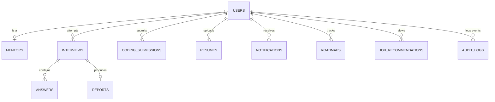

# CareerPilot AI - Database Design & ER Diagram

This document contains Mongoose collection specifications, indexes strategies, soft delete hooks, and Atlas Vector Search index configurations.

---

## 1. ER Diagram Overview



---

## 2. Atlas Vector Search Index Specifications
To query matching profiles and jobs semantically, we configure index properties within the database.

### Index Definition: `resumes_vector_index`
Defined on the `resumes` collection:
```json
{
  "mappings": {
    "dynamic": true,
    "fields": {
      "embeddings": {
        "dimensions": 768,
        "similarity": "cosine",
        "type": "knnVector"
      }
    }
  }
}
```

### Index Definition: `jobs_vector_index`
Defined on the `jobrecommendations` collection:
```json
{
  "mappings": {
    "dynamic": true,
    "fields": {
      "jobEmbeddings": {
        "dimensions": 768,
        "similarity": "cosine",
        "type": "knnVector"
      }
    }
  }
}
```

---

## 3. Database Schema Models Reference

### A. Users Collection (`users`)
- `_id`: ObjectId
- `name`: String
- `email`: String (Unique, Indexed)
- `password`: String (Hashed)
- `role`: String (Enum: `Student`, `Mentor`, `Admin`, `Super Admin`)
- `isVerified`: Boolean
- `verificationToken`: String
- `resetPasswordToken`: String
- `resetPasswordExpire`: Date
- `refreshTokens`: Array [String]
- `xp`: Number (Default: 0)
- `level`: Number (Default: 1)
- `streak`: Number (Default: 0)
- `lastActive`: Date
- `createdAt`: Date
- `updatedAt`: Date
- `isDeleted`: Boolean (Soft Delete)

**Indexes**:
- Compound: `{ email: 1, isDeleted: 1 }`
- Compound: `{ xp: -1, level: -1 }` (Leaderboard efficiency)

### B. Mentors Collection (`mentors`)
- `_id`: ObjectId
- `userId`: ObjectId (Ref: `User`, Unique)
- `specialties`: Array [String]
- `rating`: Number
- `availability`: Array [Date]
- `isDeleted`: Boolean

### C. Interviews Collection (`interviews`)
- `_id`: ObjectId
- `userId`: ObjectId (Ref: `User`)
- `domain`: String (Enum: `DSA`, `DBMS`, `System Design`, etc.)
- `difficulty`: String (Enum: `Easy`, `Medium`, `Hard`)
- `experienceLevel`: String (Enum: `Fresher`, `Intermediate`, `Advanced`)
- `status`: String (Enum: `Scheduled`, `In-Progress`, `Completed`)
- `videoUrl`: String (Webcam recording link)
- `createdAt`: Date
- `updatedAt`: Date

### D. Questions & Answers (`questions`, `answers`)
**Questions**:
- `_id`: ObjectId
- `interviewId`: ObjectId (Ref: `Interview`)
- `questionText`: String
- `expectedAnswer`: String

**Answers**:
- `_id`: ObjectId
- `interviewId`: ObjectId (Ref: `Interview`)
- `questionId`: ObjectId (Ref: `Question`)
- `userAnswerText`: String
- `audioUrl`: String
- `technicalAccuracyScore`: Number
- `communicationScore`: Number
- `confidenceScore`: Number
- `feedbackText`: String

### E. Resumes Collection (`resumes`)
- `_id`: ObjectId
- `userId`: ObjectId (Ref: `User`)
- `fileName`: String
- `fileUrl`: String
- `extractedText`: String
- `embeddings`: Array [Number] (Dimensions: 768)
- `atsScore`: Number
- `skills`: Array [String]
- `experience`: Array [Object]
- `education`: Array [Object]
- `strengths`: Array [String]
- `weaknesses`: Array [String]
- `suggestions`: Array [String]
- `isDeleted`: Boolean

**Indexes**:
- Compound: `{ userId: 1, createdAt: -1 }`

### F. AuditLogs Collection (`auditlogs`)
- `_id`: ObjectId
- `userId`: ObjectId (Ref: `User`, Optional)
- `action`: String (Enum: `LOGIN`, `LOGOUT`, `PASSWORD_CHANGE`, `RESUME_UPLOAD`, `INTERVIEW_ATTEMPT`, `CODING_SUBMISSION`, `MENTOR_ACTION`, `ADMIN_ACTION`)
- `timestamp`: Date (Default: `Date.now`)
- `ip`: String
- `userAgent`: String
- `metadata`: Schema.Types.Map (Freeform additional context)

**Indexes**:
- `{ timestamp: -1 }` (For log aggregation reviews)
- `{ userId: 1, action: 1 }`

### G. FeatureFlags Collection (`featureflags`)
- `_id`: ObjectId
- `name`: String (Unique, Indexed)
- `description`: String
- `isEnabled`: Boolean (Global override)
- `allowedRoles`: Array [String] (Role-level check)
- `allowedUsers`: Array [ObjectId] (User-level overrides)
- `createdAt`: Date
- `updatedAt`: Date
